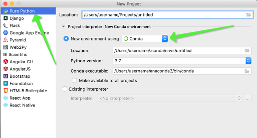

# Configuring Your Local Anaconda Environment with PyCharm

- There is a version of PyCharm made specifically for anaconda: https://www.jetbrains.com/pycharm/promo/anaconda/. As academics, you can get the Professional version for free: https://www.jetbrains.com/student/

- During first launch, don't click "Skip." There is a button for "Install Miniconda 3" which is good. Do that.

- After the initial dialogs, click "Create a new project"
	
	- You should always create a new environment for every new project. See [Using Pip in a Conda Environment](https://www.anaconda.com/using-pip-in-a-conda-environment/) for more info. It does not waste disk space.
	- In the New Project dialog, create a new conda environment for your project by selecting "Pure Python" and new environment "Conda" as seen here: 
	  
	- If you want to use a remote Python interpreter for the project, select Existing interpreter > SSH Interpreter and provide your SSH credentials. More info: https://www.jetbrains.com/help/pycharm/configuring-remote-interpreters-via-ssh.html
	
- Always commit your environment configuration in your git repo, so you and others can recreate the environment later. This process also records pip packages, so it obsoletes the need for `requirements.txt`. Always install conda packages before any pip packages. If you need to install conda packages after you've already installed pip packages, it is recommended that you recreate your conda environment, with `conda env remove` followed by `conda env create -f conda-environment.yml`

  - Export your active environment to a new file

          conda env export > conda-environment.yml

  - Create a new environment from  `conda-environment.yml`
  
         conda env create -f conda-environment.yml

- With your project open, go to the `Terminal` tab (or go to View > Tool Windows > Terminal). Notice your complete anaconda environment is available in this Terminal, so you can run `conda` commands. Notice your project environment is activated, by the `(projectname)` preceding the command prompt.

  - If you want your regular Terminal (outside of PyCharm) to also use this anaconda environment, do this one-time setup. Use the `--dry-run` option first to see what it will do, then repeat without `--dry-run`.

          cd to the bin dir of your anaconda3 directory (probably ~/miniconda3/bin)
          ./conda init --dry-run

  - After running `conda init` and restarting your Terminal, you will notice the command prompt preceded by `(base)` indicating that conda is loaded, but no environment is activated. You can list your environments by `conda env list` and you can activate by `conda activate` and `conda deactivate`.

- To install PyTorch 

  - Browse to https://pytorch.org > Get Started
  - Use the configuration matrix.
  - Paste the command into your anaconda-enabled Terminal (see above)

- To install TensorFlow 
  - Do not install any pip packages until after you have installed all conda packages. See [Using Pip in a Conda Environment](https://www.anaconda.com/using-pip-in-a-conda-environment/).  If you need to install conda packages after you've already installed pip packages, it is recommended that you recreate your conda environment (see above).
  - If you have GPU (not supported on Mac): `pip install tensorflow-gpu`
  - If you don’t have GPU: `pip install tensorflow`
